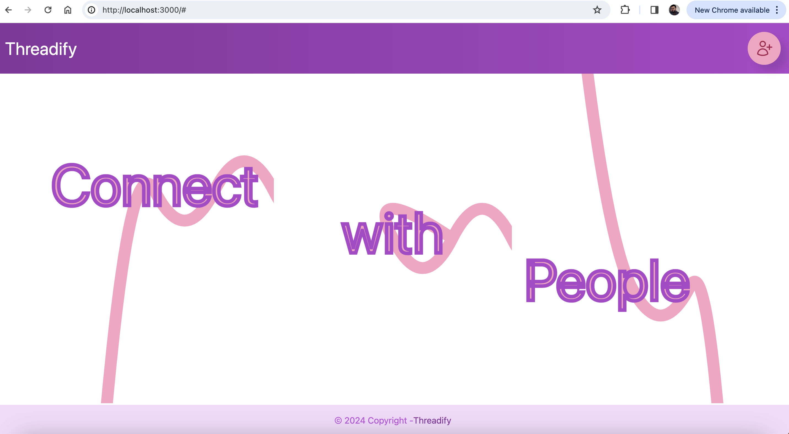
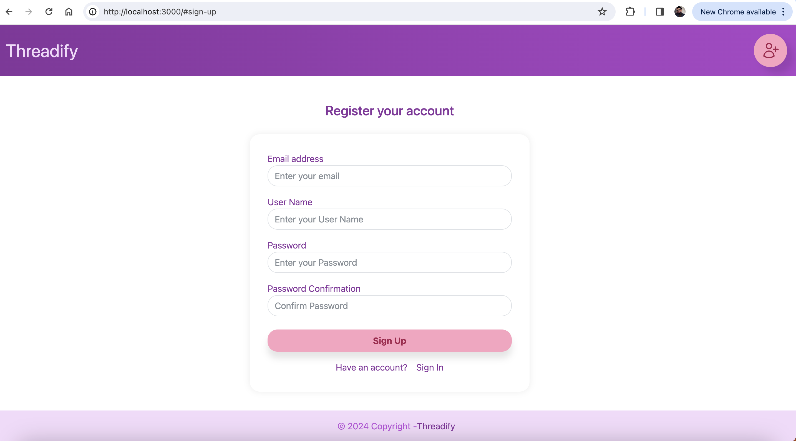
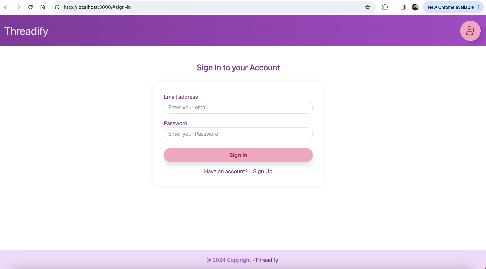
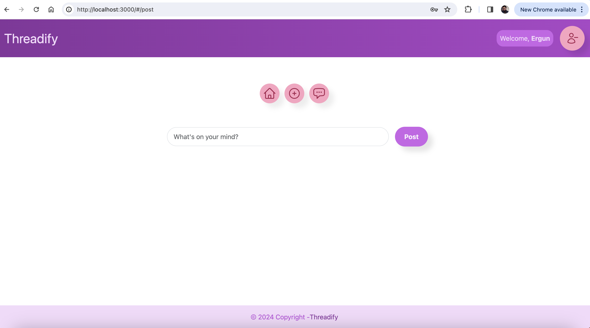
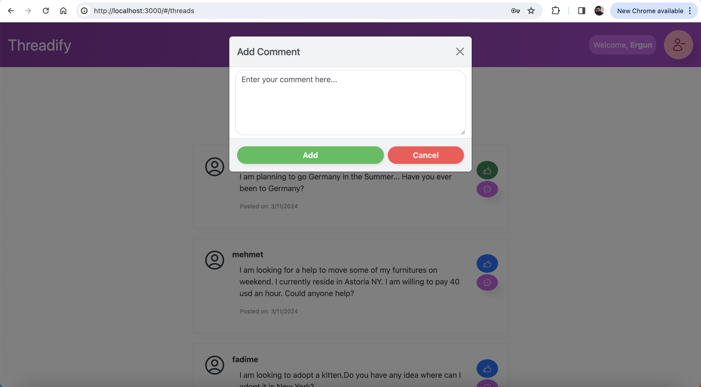
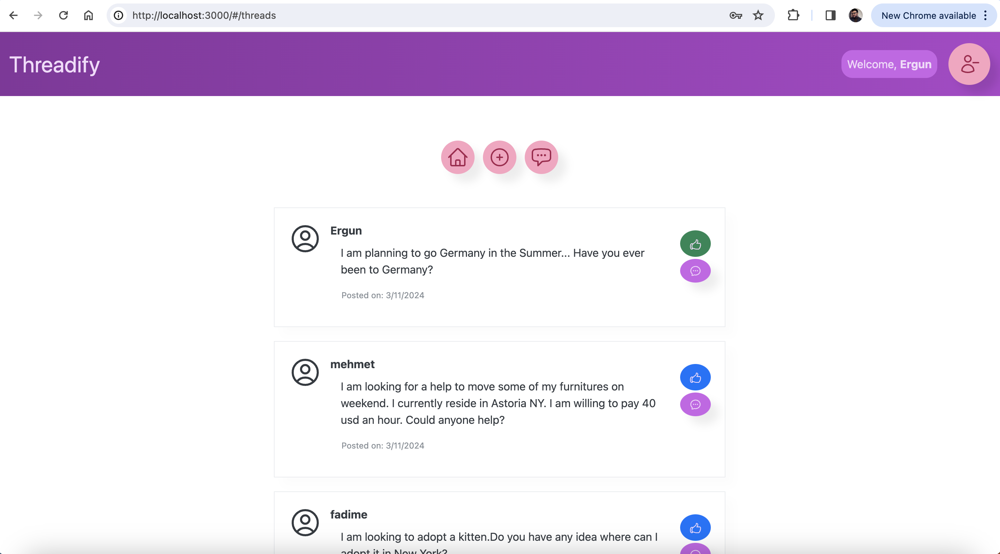
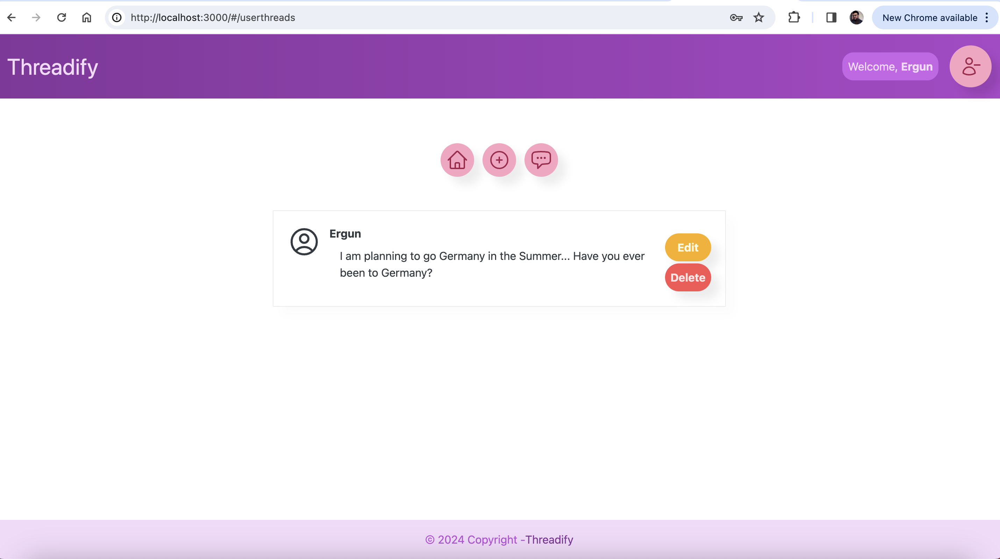
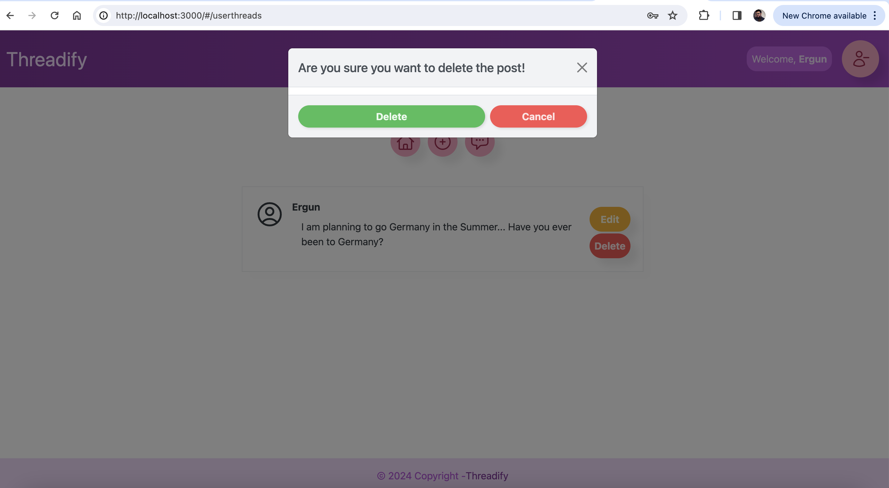
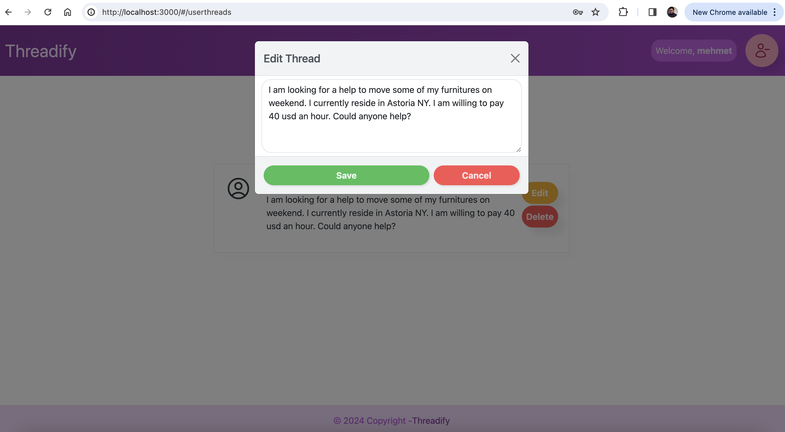

## Table of Contents

1. [Project Name and Description](#1---project-name-and-description)

   - [Project Name](#project-name)
   - [Description](#description)
   - [Why Threadify](#why-Threadify)
   - [Key Aims](#key-aims)
   - [Inspiration from Twitter](#inspiration-from-twitter)
   - [Beyond Expectations](#beyond-expectations)

2. [Installation Instructions](#2---installation-instructions)

   - [Clone the Repository](#1-clone-the-repository)
   - [Install Dependencies](#2-install-dependencies)
   - [Run the Application](#3-run-the-application)
   - [Access the Application](#4-access-the-application)

3. [Deployment](#3---deployement-instructions)

4. [Usage](#4---usage)

   - [Navigate through Threads](#1-navigate-through-threads)
   - [Contribute to Discussions](#2-contribute-to-discussions)
   - [Interact with Posts](#3-interact-with-posts)

5. [Technologies Used](#5---technologies-used)

   - [React](#1-react)
   - [JSX](#2-jsx)
   - [CSS](#3-css)
   - [JavaScript](#4-javascript)

6. [Features](#6---features)

   - [Secure Account Creation and Authentication](#1-secure-account-creation-and-authentication)
   - [Effortless Account Login and Logout](#2-effortless-account-login-and-logout)
   - [Thread Creation and Interaction](#3-thread-creation-and-interaction)
   - [Personalized Thread Management](#4-personalized-thread-management)
   - [Thread Exploration and Interaction](#5-thread-exploration-and-interaction)
   - [Secure Sign-Out Functionality](#6-secure-sign-out-functionality)

7. [Upcoming Features](#7---upcoming-features)

   - [Account Management](#1-account-management)
   - [Contributions Count and Thread History](#2-contributions-count-and-thread-history)
   - [User Levels and Rewards](#3-user-levels-and-rewards)
   - [Advantages for Each Level](#4-advantages-for-each-level)
   - [Enhanced User Control](#5-enhanced-user-control)
   - [Upcoming Features: CSS Enhancements](#6-upcoming-features-css-enhancements)

8. [Screenshots or GIFs](#8---screenshots-or-gifs)

9. [Contributing Guidelines](#9---contributing-guidelines)

   - [Fork the Repository](#9-1-fork-the-repository)
   - [Clone the Repository](#9-2-clone-the-repository)
   - [Create a Branch](#9-3-create-a-branch)
   - [Make Changes](#9-4-make-changes)
   - [Commit Changes](#9-5-commit-changes)
   - [Push Changes](#9-6-push-changes)
   - [Submit a Pull Request](#9-7-submit-a-pull-request)
   - [Code Review](#9-8-code-review)
   - [Merge Pull Request](#9-9-merge-pull-request)

10. [License](#10---license)

11. [Acknowledgments](#11---acknowledgments)

## 1 - Project Name and Description

### Project Name

Threadify

### Description

This is the frontend repo of the project. Please find backend backend repo : https://github.com/nugrezo/threadify-server

Threadify is a dynamic and user-centric web application, focusing on fostering meaningful discussions and interactions. Inspired by the concise nature of Threads app.

### Why Threadify

In a digital age marked by information sharing, the Threadify provides a platform for users to engage in open dialogue, share insights, and connect with like-minded individuals. It serves as a hub for diverse perspectives, facilitating the exchange of ideas and knowledge.

### Key Aims

1.  **Community Engagement**

The Threadify aims to bring people together by providing a space for community engagement and collaboration. Users can discuss various topics, share experiences, and build connections in a virtual environment.

2. **Knowledge Sharing**

As a knowledge-sharing platform, the Threadify encourages users to contribute their expertise and insights. This collaborative approach promotes continuous learning and the dissemination of valuable information.

#### 3 - Inspiration from Threads:

Taking inspiration from the concise and real-time nature of Threads, the Threads adapts these qualities to foster quick and meaningful interactions. The platform aims to capture the essence of dynamic discussions in a more expansive and collaborative setting.

### Beyond Expectations

While the Threadify caters to conventional forum functionalities, it also introduces innovative features that transcend expectations. From intuitive user interfaces to novel ways of content discovery, the application strives to redefine the forum experience.

Embrace the Threadify as not just a digital meeting place but a dynamic space where ideas flourish, connections form, and users actively shape the narrative. Join the conversation and explore the limitless possibilities within the Threadify.

## 2 - Installation Instructions

To set up the Threadify front-end application developed with React, follow these simple steps:

1. **Clone the Repository**

git clone https://github.com/nugrezo/Threadify-client.git

cd threadify-client

2. **Install Dependencies**

npm install

3. **Run the Application**

npm start

4. **Access the Application**

Open your browser and navigate to http://localhost:3000 to view the Threadify.

That's it! You've successfully installed and launched the Threadify front-end application. Dive into the world of dynamic discussions and collaborative interactions.

## 3 - Deployment

Before deploying, you first need to make sure the `homepage` key in your
`package.json` is pointing to the correct value. It should be the url of your
deployed application.

To deploy you should first make sure you are on the `master` branch with a
clean working directory, then you can run `npm run deploy` and wait to see if
it runs successfully.

## 4 - Usage

The Threadify front-end application is designed to offer a seamless and engaging experience for users. Here's how you can make the most of its features:

1. **Navigate through Threads**

Explore diverse discussions by navigating through threads created by users. Click on the comments button of each thread to delve into the conversations and discover a wealth of topics.

2. **Contribute to Discussions**

Engage actively by creating your own threads. Share your thoughts, experiences, or questions to initiate meaningful discussions within the community.

3. **Interact with Posts**

Like and comment on posts to express appreciation or contribute to ongoing conversations. The Threadify encourages interaction, fostering a vibrant and collaborative environment.

## 5 - Technologies Used

1. **React**

Leveraging the power of React, the application achieves a responsive and dynamic user interface. React's component-based architecture facilitates modular development and seamless updates.

2. **Axios**

Axios is used to make the HTTP client request for the below api end points.

- POST/sign-up - to sign-up new user.
- POST/sign-in - to sign-in user.
- DELETE/sign-out - to sign-out user.
- PATCH/change-password - to change password.
- POST/threads - to create a thread.
- GET/threads - to show all threads created by all the users.
- DELETE/threads/id - to delete the thread by the owner of the thread.
- PATCH/threads/id - to update the thread by the owner of the thread.
- GET/threads/ - to display the thread by the owner of the thread.
- POST/threads/id/comment - to create a comment to a specific thread by the authenticated user.
- POST/threads/id/like - to like the specific thread by the authenticated user.

3. **CSS**

Cascading Style Sheets (CSS) is utilized to style and design the application, ensuring a visually appealing and cohesive presentation. Custom styling enhances the user experience and aligns with modern design principles.

4. **BootStrap**

Bootstrap is used for responsive designed for buttons and forms and alert user messages.

5. **JavaScript**

JavaScript is employed for adding interactivity and functionality to the application. From handling user interactions to managing asynchronous requests, JavaScript enhances the overall responsiveness of the Threadify.

## 6 - Features

### `<AuthenticatedRoute />`

This template contains a handy component for creating routes that require a
user to be authenticated before visiting. This component lives in
`src/auth/components/AuthenticatedRoute.js` and is already required in `App`.
It's a thin wrapper around React Router's `<Route />` component. The only
difference is that it expects a prop called `user`, and if that prop is falsy,
it will render a `<Redirect />` that takes the user to `/`. **To use
it, you must pass it the user as a prop!**

It supports both the `component=` and `render=` attributes, but like `<Route />`
it will not forward props to the component if you use `component=`.

### `<AutoAlertDismiss />` Component

This template also already contains a component that displays user messages.
Messages are configurable via redux actions. This component can be found in
`src/components/AutoAlertDismiss/AutoAlertDismiss.js`. **There is no need to add
this component to your app. It is already required in `App`.** A single
component instance is used to manage all alerts application-wide.

The alert can be used by passing the `alertMsg` method to a rendered route. The
`alertMsg` method expects an object with a `heading`, `message`, and a `variant` property.

Use this component in conjunction with the `messages.js` file in the same
directory to create and manage all of your application messages in one place.

The `variant` property must be a Bootstrap alert variant, as this component is merely a
wrapper around the [react-bootstrap Alert
component](https://react-bootstrap.github.io/components/alerts/). The types it
will accept are: 'primary', 'secondary', 'success', 'danger', 'warning', 'info',
'light', and 'dark'.

To change the duration of the message, replace `5000` with a value of your
choice (in milliseconds) in this component's `componentDidMount` method.

### `src/apiConfig.js`

this file will determine whether you're in a production or development
environment and choose an API URL accordingly. Don't forget to replace the
`production` URL with your deployed API's URL.

## Structure

The top-level `App` component stores the currently authenticated
user in state, as well as data related to the flash messages. `App` renders the
`Header` component, and a list of routes, each of which render a component from
`src/components`. The `src/api` directory has a component file, `auth.js`, which
contains all the needed `axios` calls pertaining to authentication.

You can follow this pattern in your app as well. For instance, if you are making
an app that keeps track of books, you might want a `src/api/books.js`, which
contains its own `axios` call pertaining to your books resource CRUD actions.
Using a separate directory within `components` for each individual component you
add makes it easy to locate and update components and has the added benefit of
making it easy to create custom styles that apply to that specific component.
To apply component specific styles, add a file to the component's directory such
as `ComponentName.scss` and then import it directly into the component with
`import './ComponentName.scss'`. This will keep your styles modularized and
make it easier to make changes at the component level.

1. **Secure Account Creation and Authentication**

Users can securely create accounts using a unique username, email, and password. The Threadify employs robust authentication mechanisms to ensure the privacy and security of user information.

2. **Effortless Account Login and Logout**

Once registered, users can seamlessly log in to their accounts, providing a personalized and secure experience. The logout feature ensures a secure session termination, prioritizing user privacy.

3. **Thread Creation and Interaction**

Users are empowered to create threads, fostering a diverse range of discussions. They can actively engage with other users by liking and commenting on threads, contributing to a dynamic and collaborative forum environment.

4. **Personalized Thread Management**

The Threadify offers users the ability to create, comment on, and like threads. Each user can manage and interact with the threads they've created, enhancing a sense of ownership and contribution within the community.

5. **Thread Exploration and Interaction**

Users can explore and interact with threads created by others. The platform promotes a vibrant community atmosphere, encouraging users to read, like, and comment on threads contributed by their peers.

6. **Secure Sign-Out Functionality**

Users can securely sign out of their accounts to ensure the protection of their personal information. The sign-out feature guarantees a complete and secure session closure.

These features collectively provide users with a comprehensive and secure experience within the Threadify. From account creation to active participation in discussions, the platform prioritizes user privacy, engagement, and seamless interaction.

## 7 - Upcoming features

1. **Account Management**

Users will have the capability to manage their accounts, allowing them to modify email addresses and update passwords. This feature enhances user control and customization within the Threadify.

2. **Contributions Count and Thread History**

Users can track their contributions through a contributions count, providing insights into their active participation within the forum. Additionally, users will be able to view a history of their previous threads, creating a comprehensive overview of their engagement.

3. **User Levels and Rewards**

Introducing a tiered user level system, including levels such as Blue, Gold, Silver, Platinum, and Diamond, based on user contributions. Each level will come with unique advantages, fostering a sense of achievement and recognition within the community.

4. **Advantages for Each Level**

Users at different levels will receive exclusive benefits, though the specific details of these advantages are yet to be decided. This upcoming feature aims to enhance user experience and engagement, providing incentives for active participation.

As these features are implemented, the Threadify will evolve into a more dynamic and rewarding platform, encouraging sustained user interaction and fostering a strong sense of community within each level.

5. **Enhanced User Control**

In addition to the upcoming features, users will soon gain the ability to manage their content more effectively with the introduction of a post deletion feature. This empowers users with greater control over their contributions, allowing them to curate and refine their presence within the forum. The deletion feature aligns with the Threadify's commitment to providing users with a personalized and customizable experience, ensuring that their engagement with the platform remains in their hands.

6. **Upcoming Features: CSS Enhancements**

**Custom Styling Options:**

- Explore upcoming features that offer users the ability to apply custom styling to their threads and comments. Tailor the appearance of your contributions to express your unique style within the Threadify.

**Theme Customization:**

- Soon, users will have the opportunity to personalize their forum experience further by choosing from a variety of themes. Whether it's a light or dark theme, customization options will be at your fingertips.

**Responsive Design Improvements:**

- Stay tuned for CSS enhancements aimed at refining the responsive design of the Threadify. The upcoming improvements will ensure a consistent and user-friendly experience across various devices.

**User Profile Customization:**

- Users will soon be able to enhance the visual appeal of their profiles by customizing the appearance through CSS. Showcase your personality and preferences within the community with unique profile styles.

As we continually work on enhancing the CSS features of the Threadify, we are committed to providing users with a visually appealing and customizable platform. Keep an eye out for updates as we strive to create an even more engaging and aesthetically pleasing forum experience.

## 8 - Screenshots or GIFs

**Login account View screenshot**

**Create account View screenshot**

**Sign-In account View screenshot**

**Create Thread View screenshot**

**Comment Thread View screenshot**

**Replied Thread View screenshot**

**User Thread View screenshot**

**Delete Thread View screenshot**

**Edit Thread View screenshot**

## 9 - Contributing Guidelines

I appreciate your interest in contributing to the Threadify project. Your contributions play a vital role in enhancing the overall experience for our users. Before you get started, please take a moment to review the following guidelines:

Fork the Repository:

Fork the Threadify repository to your GitHub account.

Clone the Repository:

Clone the forked repository to your local machine using the following command:

git clone https://github.com/nugrezo/threadify-client

Create a Branch:

Create a new branch for your contributions:

git checkout -b feature/your-feature-name

Make Changes:

Implement your desired changes, enhancements, or fixes within your branch.

Commit Changes:

Commit your changes with clear and concise commit messages:

git commit -m "Brief description of your changes"

Push Changes:

git push origin feature/your-feature-name

Submit a Pull Request:

Create a pull request from your branch to the main repository's develop branch. Be sure to provide a detailed description of your changes.

Code Review:

Expect feedback and engage in discussions related to your pull request. Make any necessary adjustments based on the feedback received.

Merge Pull Request:

Once your pull request is approved, it will be merged into the main repository.

Thank you for your contributions! Your efforts contribute to the growth and improvement of the Threadify project.

## 10 - License

The Threadify project is licensed under the Threadify_joz]. This license grants users the freedom to use, modify, and distribute the software within the terms specified in the license document.

## 11 - Acknowledgments

I would like to express my gratitude to individuals and organizations that have contributed directly or indirectly to the development and success of the Threadify project. Their support and inspiration have played a crucial role in shaping the project into what it is today.

Special thanks to:

**Sam Williams**: Inspired me throughout the project and gave me an ultimate guide to build front-end and back-end guides.

Your commitment and contributions are highly appreciated, and I extend my sincere thanks to everyone who has been part of this journey. The collaborative spirit of the community has made the Threadify project possible and continues to drive its growth and success.
.
